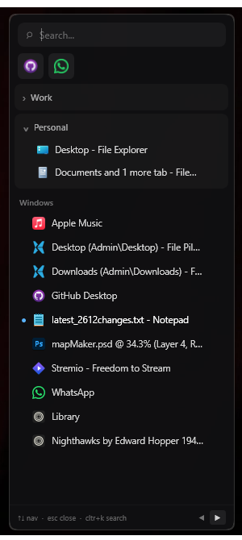

# winhopper

arc-inspired window switcher for windows. fast, keyboard-native, minimal.

 




## what it has so far
- **hotkey trigger**: `Ctrl+Space` to toggle
- **edge trigger**: hover screen edge to activate  
- **workspaces**: group windows by project/context
- **pinned apps**: quick access to favorites
- **search**: `Ctrl+K` to filter instantly
- **close windows**: middle-click or hover close button
- **keyboard native**: `↑↓` navigate, `Enter` open, `Esc` close

## installation

### portable 
1. Download `WinHop.exe` from [Releases](../../releases)
2. Run it - no install needed

### build from source
```bash
git clone https://github.com/sudotman/winhopper.git
cd winhopper
dotnet publish WinHop/WinHop.csproj -c Release -r win-x64 --self-contained -p:PublishSingleFile=true
```
Output: `WinHop/bin/Release/net9.0-windows/win-x64/publish/WinHop.exe`

## usage

| action | shortcut |
|--------|----------|
| toggle sidebar | `Ctrl+Space` |
| search | `Ctrl+K` or just type |
| navigate | `↑` `↓` |
| open window | `Enter` or click |
| close window | middle-click or `×` button |
| close sidebar | `Esc` or move mouse away |
| quick select | `1-9` keys |

### workspaces
right-click any window → **Add to workspace** to organize by project.  
workspace windows stay grouped alike arc.
### pinned Apps
right-click → **Pin to top** for quick access.  
right-click pinned icon → **Unpin** to remove.

## config

settings saved to `%APPDATA%/WinHop/settings.json`:
- Edge triggers (left/right)
- Pinned apps
- Workspaces

## license

MIT
